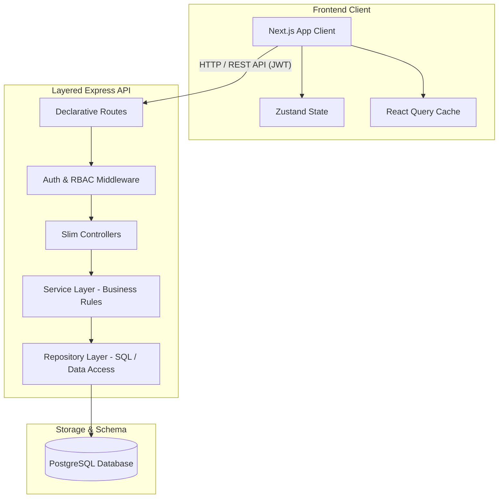

# 🏢 Rental Hub — Enterprise Rental Listing & Property Management System

An open-source, full-stack, enterprise-grade rental listing platform designed to model real-world property management workflows. Built with a highly structured, scalable **Express.js API** backend following the **Controller-Service-Repository (layered)** architectural pattern, and a modern, high-performance **Next.js 16** frontend client with **React 19**, **TypeScript**, and **Tailwind CSS**.

The system features robust role-based access control (RBAC), database transaction boundaries, strict service-layer authorization, and secure, controlled exposure of sensitive owner/listing information.

---

## 🧱 System Architecture & Tech Stack

This project is built as a highly decoupled, clean monorepo setup:



### Key Technologies
* **Frontend**: Next.js 16 (App Router), React 19, TypeScript, Tailwind CSS, Zustand, React Query (TanStack), Axios, Shadcn UI / Radix UI.
* **Backend**: Node.js, Express.js (Layered Architecture), pg (node-postgres), JWT (jsonwebtoken), bcrypt, Jest & Supertest.
* **Database**: PostgreSQL (relational structure, custom indexes, relational integrity).
* **Infrastructure**: Docker & Docker Compose.

---

## 👥 Role-Based Access Control (RBAC)

The application enforces a granular security matrix across three distinct user roles:

| Feature / Action | 👤 Standard User | 🏡 Property Owner | 👑 System Admin |
| :--- | :---: | :---: | :---: |
| **Browse & Filter Listings** | ✅ | ✅ | ✅ |
| **View Listing Details** | ✅ | ✅ | ✅ |
| **Manage Own Listings (CRUD)** | ❌ | ✅ | ✅ |
| **Manage Availability & Rates** | ❌ | ✅ | ✅ |
| **Create Owner Accounts** | ❌ | ❌ | ✅ |
| **Moderate/Update All Listings** | ❌ | ❌ | ✅ |
| **Access Sensitive Contact Info** | Restricted | Restricted (Own Only) | ✅ (Unrestricted) |

---

## 🚀 Quick Start Guide

You can run the entire system using either Docker Compose (recommended for production/mock environment simulation) or standard local node processes.

### Prerequisites
* **Node.js** (v18.0.0+ recommended)
* **npm** (v9.0.0+ or pnpm / yarn)
* **PostgreSQL** instance (if running locally without Docker)
* **Docker & Docker Compose** (optional, for containerized execution)

---

### Option A: Running with Docker Compose (Recommended)

To stand up the complete system (Next.js frontend, Express backend API, and Postgres DB) with automated database schema initialization:

```bash
# Start the entire full-stack system in the background
docker compose -f docker-compose.yml --env-file .env.docker up --build -d
```

Once healthy:
* 🌐 **Next.js Frontend Client:** Runs on [http://localhost:3000](http://localhost:3000)
* 🔙 **Express Backend API Gateway:** Serves endpoints on [http://localhost:5000/api/v1](http://localhost:5000/api/v1)
* 🗄️ **PostgreSQL Database Engine:** Runs on port `5432`, initialized automatically via `database_schema.sql`.

---

### Option B: Running Locally (Manual Setup)

#### 1. Setup the Database
1. Create a PostgreSQL database called `rental_system`.
2. Populate the database schema using the schema migration script:
   ```bash
   psql -U postgres -d rental_system -f database_schema.sql
   ```

#### 2. Backend API Setup
1. Navigate to the backend directory and install dependencies:
   ```bash
   cd backend
   npm install
   ```
2. Create your `.env` configuration:
   ```bash
   cp ../env.example .env
   ```
   *(Update the `.env` variables with your local database credentials).*
3. Seed mock data into the database (optional but highly recommended):
   ```bash
   node src/seed.js
   ```
4. Boot the server in development mode (with nodemon hot-reload):
   ```bash
   npm run dev
   ```
   *API will start on `http://localhost:5000/api/v1`.*

#### 3. Frontend Next.js Client Setup
1. Navigate to the frontend directory and install dependencies:
   ```bash
   cd ../frontend
   npm install
   ```
2. Create your `.env.local` configuration:
   ```bash
   # Create a local .env configuration using the root public variables
   echo "NEXT_PUBLIC_API_URL=http://localhost:5000/api/v1" > .env.local
   ```
3. Start the Next.js local development server:
   ```bash
   npm run dev
   ```
   *Frontend dashboard will be active on `http://localhost:3000`.*

---

## ⚙️ Environment Variables Schema

To maintain strong security boundaries, ensure standard configuration files are updated. Here are the core environment properties:

### Docker Integrated Configuration (`.env.docker`)
```env
# PostgreSQL Container engine credentials
POSTGRES_USER=postgres
POSTGRES_PASSWORD=your_super_secure_pg_password_2026
POSTGRES_DB=rentalhub

# Backend Express API Service Configurations
PORT=5000
NODE_ENV=production
DB_HOST=db                                       # Points directly to database service name
DB_PORT=5432
DB_USER=postgres
DB_PASSWORD=your_super_secure_pg_password_2026
DB_NAME=rentalhub
JWT_SECRET=use_a_64_char_secure_hex

# Frontend Next.js Dashboard Configurations
FRONTEND_PORT=3000
NEXT_PUBLIC_API_URL=http://localhost:5000/api/v1 # Matches client browser request gateway
```

### Backend Local Configuration (`backend/.env`)
```env
PORT=5000                                 # Local port Express binds to
DB_HOST=localhost                         # Database host address
DB_PORT=5432                              # Database port
DB_USER=postgres                          # Database user
DB_PASSWORD=your_secure_password          # Database password
DB_NAME=rental_system                     # Database target catalog name
JWT_SECRET=use_a_64_char_secure_hex       # Encryption salt for auth tokens
```

### Frontend Local Configuration (`frontend/.env.local`)
```env
NEXT_PUBLIC_API_URL=http://localhost:5000/api/v1 # Path pointing to Express Gateway
```

---

## 📂 Core Repository Architecture

The project directory structure is designed to isolate concerns, separating data queries, endpoints, styles, and view controls:

```
├── backend/
│   ├── src/
│   │   ├── config/          # DB connections and external systems configs
│   │   ├── controllers/     # Slim HTTP input parsers & response formatters
│   │   ├── errors/          # Custom standardized operational error exceptions
│   │   ├── middlewares/     # Router interceptors (RBAC, JWT validators, sanitizers)
│   │   ├── repositories/    # Direct SQL query isolation & transactional interfaces
│   │   ├── routes/          # Declarative API gateways / endpoints mapping
│   │   ├── services/        # Central core containing pure business logic & guards
│   │   ├── app.js           # Main app initialization & middle integration
│   │   └── server.js        # Server bootstrapper & listener
│   └── tests/               # Backend testing suites (Supertest, integration)
│
├── frontend/
│   ├── app/                 # Next.js App Router (Layouts, routes, views)
│   ├── components/          # Reusable component elements (Radix, Shadcn)
│   ├── constants/           # Core static variables and configurations
│   ├── hooks/               # Custom React utility hooks
│   ├── lib/                 # Core network layers (Axios instances, helpers)
│   ├── stores/              # Front-end state managers (Zustand)
│   └── types/               # Type-safe global TypeScript contracts
│
├── docs/                    # Architecture diagrams, guides, and system design overviews
├── postman/                 # Integrated API verification environments, globals, and collections
├── database_schema.sql      # Main database creation & custom schema configuration
├── compose.yaml             # Main Docker Compose runtime configuration
└── SECURITY.md              # Project security and report protocol definitions
```

---

## 🛡️ Security Guardrails & Auditing

* **JWT Authenticator**: Authentication relies on client-signed, ephemeral JSON Web Tokens (1-hour expiration) with cryptographically secure salts.
* **Bcrypt Hashing**: All client passwords undergo salt hashing (12 rounds) using `bcrypt` before storage.
* **SQL Injection Guards**: The database adapter (`pg`) parameterizes all relational queries, eliminating SQL injection vectors.
* **Service-Level Access Guards**: Controllers never directly fetch data without passing through service-layer ownership verifications. Even if an endpoint is exposed, resources are cross-checked against the caller's JWT claims.
* **Audit Trails**: Real-world operations like `/contact/:listingId` are designed with strict tracking systems to prevent scraper bots from exhausting systems.

For full disclosure and detailed vulnerability reporting protocols, refer to [SECURITY.md](file:///c:/Users/AC/Desktop/Workplace/Projects/rental_hub/SECURITY.md).

---

## 📄 License
This repository is licensed under the ISC License. Created for architectural and modern web demonstration purposes.
