# Rental Listing Management System

A full-stack rental listing application: a Next.js web client and an Express REST API backed by PostgreSQL. Visitors can browse published listings. Registered users can send inquiries to owners and apply to become owners. Owners create, edit, publish, archive and delete their own listings and read inquiries on them. Admins approve or reject owner requests, manage listings across owners, and view users and statistics.

There is no payment, booking, image upload or messaging beyond one-way inquiries. Listings have no photos or description fields, only title, type, city, area, price and availability.

## Table of contents

- [Tech stack](#tech-stack)
- [Features](#features)
- [Prerequisites](#prerequisites)
- [Run with Docker Compose](#run-with-docker-compose)
- [Run locally](#run-locally)
- [Configuration](#configuration)
- [Usage and API](#usage-and-api)
- [Useful commands](#useful-commands)
- [Project structure](#project-structure)
- [Known issues and limitations](#known-issues-and-limitations)
- [Architecture](#architecture)
- [Data flow diagrams (DFD)](#data-flow-diagrams-dfd)
- [Data model](#data-model)
- [Low-level design (LLD)](#low-level-design-lld)
- [Architecture decision records](#architecture-decision-records)
- [Bug-fix case studies](#bug-fix-case-studies)

## Tech stack

| Layer | Details |
| --- | --- |
| Frontend | Next.js 16.2 (App Router, `output: 'standalone'`), React 19, TypeScript 5.7, Tailwind CSS 4, Radix UI / shadcn-style components, TanStack Query 5, Zustand 5, Axios, React Hook Form + Zod 3, Sonner toasts, Recharts |
| Backend | Node.js, Express 5, CommonJS JavaScript, `pg`, `jsonwebtoken`, `bcrypt`, `cookie-parser`, `cors`, `compression`, `dotenv` |
| Database | PostgreSQL 16 (`postgres:16-alpine` in Compose), `pg_trgm` extension, row-level security policies, DB triggers |
| Auth | JWT in an HTTP-only cookie (`rental_session`, 1 hour), optional Google OAuth 2.0 (hand-rolled, no SDK), custom CSRF/origin checks |
| Tooling | Jest 30 + Supertest, Nodemon, ESLint, Prettier, `@next/bundle-analyzer` |
| Containers | `backend/Dockerfile`, `frontend/Dockerfile`, `compose.yaml` |

Dependencies that are installed but **not used** by the code: `express-rate-limit` (no rate limiting is configured), `@faker-js/faker`, and the Neon packages (`@neon/auth`, `@neon/neon-js`, `@neondatabase/neon-js`).

## Features

- **Public:** landing page (`/`), listing search with pagination (`/listings`), system health page (`/status`).
- **Users (role `user`):** register / log in (password or Google), view listing details (login required), send inquiries, view their own inquiries, apply to become an owner and check request status.
- **Owners (role `owner`):** CRUD on own listings, publish/archive, view inquiries received on their listings.
- **Admins (role `admin`):** review owner requests (approve → user's role becomes `owner`), list all users, view stats, and manage any listing through the owner endpoints.
- **Operations:** liveness/readiness/health endpoints, request IDs and `Server-Timing` headers, slow query/request logging, a 30-second in-memory cache for anonymous listing searches.

### Frontend routes

| Path | Access |
| --- | --- |
| `/`, `/listings`, `/status` | Public |
| `/login`, `/register` | Signed-out users |
| `/listings/[id]`, `/become-owner`, `/owner-status` | Signed-in users |
| `/dashboard` | Owners |
| `/admin/dashboard`, `/admin/requests`, `/admin/users` | Admins |

Route protection in the UI is done by `ProtectedRoute` / `RedirectIfAuthenticated` components; there is no Next.js middleware. The API enforces roles independently.

## Prerequisites

- **Node.js 20.9 or later** and npm (required by Next.js 16; the backend Docker runtime image uses Node 18).
- **PostgreSQL 16** with `psql`, **or** Docker Engine with the Compose plugin.
- Git.

The frontend ships both `package-lock.json` and `pnpm-lock.yaml`; the Dockerfile and the commands below use npm.

## Run with Docker Compose

`compose.yaml` reads a root `.env`. The root `.env.example` is **not complete** for Compose: it lacks `POSTGRES_*`, `NODE_ENV` and `FRONTEND_PORT`, and its `DB_HOST=localhost` must be `db`. Create `.env` like this:

```bash
cp .env.example .env
```

```dotenv
POSTGRES_USER=postgres
POSTGRES_PASSWORD=replace_with_a_local_password
POSTGRES_DB=rental_system
PORT=5000
NODE_ENV=production
DB_HOST=db
DB_PORT=5432
DB_USER=postgres
DB_PASSWORD=replace_with_a_local_password
DB_NAME=rental_system
JWT_SECRET=replace_with_a_long_random_secret
FRONTEND_PORT=3000
NEXT_PUBLIC_API_URL=http://localhost:5000/api/v1
```

```bash
docker compose --env-file .env up --build
```

- Web client: <http://localhost:3000>
- API: <http://localhost:5000/api/v1>
- PostgreSQL: `localhost:5432`

`database_schema.sql` is mounted into the Postgres init directory and runs **only when the data volume is empty**.

```bash
docker compose --env-file .env down        # stop, keep data
docker compose --env-file .env down -v     # stop and delete the database volume
```

`NEXT_PUBLIC_API_URL` is baked into the frontend image at build time. See [Known issues](#known-issues-and-limitations) for what Compose does not pass through.

## Run locally

### 1. Create the database

```bash
createdb rental_system
psql -d rental_system -f database_schema.sql
```

The schema file is not idempotent (it uses plain `CREATE TYPE` / `CREATE FUNCTION`); run it once against an empty database.

### 2. Start the API

```bash
cp backend/.env.example backend/.env
cd backend
npm ci
npm run dev        # nodemon; use `npm start` for plain node
```

Edit `backend/.env` first (DB credentials, `JWT_SECRET`). The server listens after startup and then tries to connect to Postgres; it logs an error but keeps running if the connection fails.

### 3. Start the frontend

```bash
cp frontend/.env.example frontend/.env.local
cd frontend
npm ci
npm run dev
```

The dev server runs at <http://localhost:3000>. Keep `NEXT_PUBLIC_API_URL=http://localhost:5000/api/v1` in `frontend/.env.local`; otherwise browser calls go to `/api/v1`, which `next.config.mjs` rewrites to the deployed Render API.

### Optional: demo data and extra scripts

Run from `backend/` (none of these have npm scripts):

```bash
node src/seed.js                     # DESTRUCTIVE: truncates users, owner_requests and listings, then inserts demo accounts/listings (credentials are printed at the end)
node src/scripts/migrate.js          # legacy, idempotent migration for older databases
node hash.js 'SomePassword1!'        # prints a bcrypt hash (12 rounds)
psql -d rental_system -f src/migrations/20261113_listing_query_indexes.sql   # listing-search indexes for older databases
```

`src/scripts/seedAdmin.js` inserts `admin@example.com` with a hard-coded password; change it immediately if you use it, and never use it outside local development.

## Configuration

Copy the example files and replace placeholder secrets. Do not commit `.env` files.

### Backend (`backend/.env`)

| Variable | Required | Purpose / default |
| --- | --- | --- |
| `PORT` | No | API port. Code default is `3000`; `backend/.env.example` sets `5000`. |
| `NODE_ENV` | No | `production` makes auth cookies `Secure`. |
| `DB_HOST`, `DB_USER`, `DB_PASSWORD`, `DB_NAME` | Yes (unless `DATABASE_URL`) | Postgres connection fields. |
| `DB_PORT` | No | Default `5432`. |
| `DATABASE_URL` | Alternative | Connection string; enables SSL with `rejectUnauthorized: false`. Takes precedence over the `DB_*` fields. |
| `JWT_SECRET` | Yes | Signs session tokens. Use a long random value, e.g. `node -e "console.log(require('crypto').randomBytes(64).toString('hex'))"`. |
| `FRONTEND_URL` | Yes for Google OAuth; recommended | Allowed CORS origin and target of OAuth redirects. |
| `CORS_ORIGINS` | No | Extra comma-separated allowed origins. `http://localhost:3000` and `http://127.0.0.1:3000` are always allowed. |
| `COOKIE_SAME_SITE` | No | `lax` (default), `strict` or `none`. `none` forces `Secure` cookies (needs HTTPS). |
| `HEALTH_DETAILS` | No | `false` returns a reduced `/health` payload. |
| `DB_POOL_MAX` | No | Default `10`. |
| `DB_IDLE_TIMEOUT_MS` | No | Default `30000`. |
| `DB_CONNECTION_TIMEOUT_MS` | No | Default `5000`. |
| `DB_MAX_USES` | No | Default `7500`. |
| `GOOGLE_CLIENT_ID`, `GOOGLE_CLIENT_SECRET`, `GOOGLE_CALLBACK_URL` | Only for Google sign-in | Without all three, `/auth/google` redirects to the login page with an "unavailable" error. Example callback: `http://localhost:5000/api/v1/auth/google/callback`. |
| `APP_VERSION` | No | Overrides the version in health output. |
| `GIT_SHA`, `RENDER_GIT_COMMIT`, `COMMIT_SHA` | No | Commit reported by `/health` (first one set wins). |

### Frontend (`frontend/.env.local`)

| Variable | Purpose |
| --- | --- |
| `NEXT_PUBLIC_API_URL` | Browser-visible API base URL (`http://localhost:5000/api/v1` locally). Baked in at build time. |
| `INTERNAL_API_URL` | Optional API base for the server-rendered `/listings` page; checked before `NEXT_PUBLIC_API_URL`. |
| `API_INTERNAL_URL` | Optional server-side API base for other server code (Next.js API routes); defaults to `http://localhost:5000/api/v1`. |
| `ANALYZE` | `true` enables the bundle analyzer (`npm run analyze`). |
| `NEON_AUTH_BASE_URL`, `NEON_AUTH_COOKIE_SECRET` | Read only by `frontend/lib/auth/server.ts`, which nothing imports. Not needed. |

### Docker Compose (root `.env`)

`POSTGRES_USER`, `POSTGRES_PASSWORD`, `POSTGRES_DB` (database container), `FRONTEND_PORT`, plus `PORT`, `NODE_ENV`, `DB_*`, `JWT_SECRET` and `NEXT_PUBLIC_API_URL` as in the example above. Keep `POSTGRES_*` and `DB_*` values consistent.

### Scripts-only variables

`npm run verify:perf` reads `FRONTEND_URL`, `API_URL`, `VERIFY_CITY`, `VERIFY_TYPE` and `VERIFY_SEARCH_TERM`.

## Usage and API

All routes are under `/api/v1`. Examples assume the API on `localhost:5000`.

```bash
# Liveness (no DB) and readiness (queries DB)
curl http://localhost:5000/api/v1/health/live
curl http://localhost:5000/api/v1/health/ready

# Search published listings
curl 'http://localhost:5000/api/v1/listings?city=brooklyn&type=apartment&priceMax=2500&page=1&limit=10'

# Register (full_name, phone and address are required; phone must be an Indian mobile number)
curl -i -c cookies.txt -H 'Content-Type: application/json' \
  -d '{"email":"renter@example.test","password":"ChangeMe123!","full_name":"Sample Renter","phone":"9876543210","address":"12 Example Street, Bengaluru"}' \
  http://localhost:5000/api/v1/auth/register

# Current user (uses the saved session cookie)
curl -b cookies.txt http://localhost:5000/api/v1/auth/me

# Create a listing as an owner (note the `payload` wrapper)
curl -b cookies.txt -H 'Content-Type: application/json' \
  -d '{"payload":{"title":"Sunny 2BHK","type":"apartment","city":"Bengaluru","area":"Indiranagar","price":25000}}' \
  http://localhost:5000/api/v1/owner
```

**Passwords** must be at least 8 characters with an uppercase letter, a lowercase letter, a number and a symbol.

**Sessions and CSRF.** Login/register set the `rental_session` cookie (HTTP-only, 1 hour). Non-GET requests that carry an `Origin` header must come from an allowed origin and include `X-Requested-With: XMLHttpRequest` (the frontend client does this); plain `curl` without an `Origin` is accepted. The role is read from the token, so after an admin approves an owner request the user must sign in again to get owner access.

**Listings behaviour.** Responses look like `{ status, meta: { page, limit, totalItems, totalPages }, data }`. `limit` is at most 100; a page past the last page, or `priceMax <= priceMin`, returns 400. `title`, `type`, `city`, `area` and emails are stored lowercase (DB triggers). Anonymous searches (no cookie or `Authorization` header) are cached in memory for 30 seconds and report `X-Cache: HIT|MISS`; authenticated requests are `no-store`.

### Implemented routes

| Method | Path | Access / purpose |
| --- | --- | --- |
| `GET` | `/health/live` | Public liveness check; no DB query. |
| `GET` | `/health/ready` | Public readiness; `503` when the DB is down. |
| `GET` | `/health` | Public health report (runtime, pool and memory metrics unless `HEALTH_DETAILS=false`). |
| `GET` | `/listings` | Public published-listing search: `q`, `city`, `type`, `priceMin`, `priceMax`, `page`, `limit`. |
| `GET` | `/listings/:id` | Signed-in `user`, `owner` or `admin`. |
| `POST` | `/auth/register` | Register a `user`; body: `email`, `password`, `full_name`, `phone`, `address`; sets the session cookie. |
| `POST` | `/auth/login` | Log in with email and password; sets the session cookie. |
| `POST` | `/auth/logout` | Clears the session cookie. |
| `GET` | `/auth/me` | Current user profile. |
| `GET` | `/auth/google` | Starts Google OAuth (needs `GOOGLE_*` and `FRONTEND_URL`). |
| `GET` | `/auth/google/callback` | Google OAuth callback; redirects to the frontend. |
| `POST` | `/auth/become-owner` | `user` only; body: `property_type`, `location`, `reason`. One pending request at a time. |
| `GET` | `/auth/owner-status` | `user`, `owner` or `admin`. |
| `GET` | `/owner/owner-listings` | `owner` (own listings) or `admin` (all); supports `q`, `city`, `type`, `priceMin`, `priceMax`, `page`, `limit`. |
| `GET` | `/owner/:id` | `owner` or `admin`. |
| `POST` | `/owner` | `owner` or `admin`; body `{ "payload": { title, type, city, area?, price, is_available? } }`. |
| `PATCH` | `/owner/:id` | `owner` or `admin`; fields at the top level of the body. |
| `DELETE` | `/owner/:id` | `owner` or `admin`. |
| `PATCH` | `/owner/:id/publish` | `owner` or `admin`. |
| `PATCH` | `/owner/:id/archive` | `owner` or `admin`. |
| `POST` | `/inquiries` | `user` only; body: `listing_id`, `message`. Listing must be published and not your own. |
| `GET` | `/inquiries` | `user` only: inquiries you sent. |
| `GET` | `/inquiries/owner` | `owner` only: inquiries on your listings. |
| `GET` | `/admin/requests` | Admin: list owner requests. |
| `PATCH` | `/admin/requests/:id/approve` | Admin; sets the requester's role to `owner`. |
| `PATCH` | `/admin/requests/:id/reject` | Admin. |
| `GET` | `/admin/admin` | Admin: list users. |
| `GET` | `/admin/stats` | Admin dashboard statistics. |
| `GET` | `/test/error` | Deliberately triggers an error for testing; not a business endpoint. |

Valid listing types: `room`, `house`, `apartment`, `pg`, `villa`, `studio`. Listing statuses: `draft` (default), `published`, `archived`.

The frontend also exposes two Next.js proxy routes, `GET/POST /api/inquiries` and `GET /api/owner/inquiries`, which forward to the Express API with the caller's cookies.

A Postman collection is in `postman/collections/`.

## Useful commands

```bash
# Backend (from backend/)
npm run dev          # nodemon
npm start
npm test             # Jest + Supertest, --runInBand; needs a running Postgres with the schema loaded
npm run lint
npm run format
npm run verify:db    # EXPLAIN ANALYZE of listing queries (reads backend/.env)
npm run verify:perf  # runs ../scripts/verify-performance.mjs against a running stack

# Frontend (from frontend/)
npm run dev
npm run build
npm start
npm run lint
npm run analyze      # bundle analyzer
npm run format
```

`npm test` connects to the database configured in `backend/.env` and creates and deletes rows for emails matching `%_jest@example.com`. Use a development database. Test files: `api`, `workflow`, `health`, `authCookies`, `csrfProtection`.

## Project structure

```text
.
├── backend/
│   ├── src/
│   │   ├── config/          # db.js (pg pool, per-request DB context), authCookies.js, neon.ts (unused)
│   │   ├── controllers/     # HTTP handlers (admin, health, inquiries, listings, owner, tests, users)
│   │   ├── errors/          # AppErrors
│   │   ├── middlewares/     # requireAuth, requireRole, csrfProtection, dbContext, requestObservability
│   │   ├── migrations/      # SQL: listing query indexes (applied manually)
│   │   ├── repositories/    # PostgreSQL queries
│   │   ├── routes/          # health, tests, listings, users (/auth), admin, owner, inquiries
│   │   ├── scripts/         # migrate.js (legacy), seedAdmin.js
│   │   ├── services/        # business rules, authorization, public listings cache, health checks
│   │   ├── app.js           # Express setup and route mounting
│   │   ├── seed.js          # destructive demo-data seeder
│   │   └── server.js        # process entry point
│   ├── scripts/             # verify-db-plans.js
│   ├── tests/               # Jest + Supertest suites
│   ├── hash.js              # bcrypt hash helper
│   ├── Dockerfile
│   ├── package.json
│   └── .env.example
├── frontend/
│   ├── app/                 # App Router: (public) (auth) (user) (owner) (admin) groups, status/, api/ proxies
│   ├── components/          # auth/, layout/, providers/, ui/ (shadcn-style)
│   ├── constants/           # API base URL logic, listing/status constants
│   ├── hooks/               # use-debounce, use-health-check, use-toast, use-mobile
│   ├── lib/                 # api.ts (Axios client), services.ts, queryKeys.ts, auth/server.ts (unused)
│   ├── schemas/             # Zod schemas (auth, listing)
│   ├── scripts/             # analyze.js
│   ├── stores/              # Zustand auth store
│   ├── types/  utils/  styles/  public/
│   ├── Dockerfile
│   ├── next.config.mjs
│   ├── package.json
│   └── .env.example
├── docs/                    # PERFORMANCE_VERIFICATION.md, system_documentation.md
├── postman/                 # Postman collection and environments
├── scripts/                 # verify-performance.mjs
├── database_schema.sql      # tables, enums, RLS policies, indexes, triggers
├── compose.yaml
├── .env.example             # partial template (see Docker Compose section)
├── DOCKER_SETUP.md          # outdated, see Known issues
├── implementation_plan.md   # historical design plan
└── SECURITY.md
```

## Known issues and limitations

- **No rate limiting.** `express-rate-limit` is installed but never wired in, so login and register are not throttled.
- **RLS depends on the DB user.** The schema defines row-level security policies and a `rental_app` role without `LOGIN`, but the code never switches to that role; it connects as `DB_USER`. Postgres superusers (such as `postgres` in the examples) bypass RLS, so in that setup the application-level role and ownership checks are the effective access control.
- **Compose gaps.** The backend service does not receive `FRONTEND_URL`, `CORS_ORIGINS` or `GOOGLE_*`, so Google sign-in will not work there. The frontend service does not receive `INTERNAL_API_URL`; inside its container `http://localhost:5000` is the container itself, so server-side fetches for `/listings` are unlikely to reach the API unless you add `INTERNAL_API_URL=http://backend:5000/api/v1` to the frontend service. This was read from the code, not run. `compose.yaml` also has an obsolete `version:` key.
- **Next.js rewrite to a deployed API.** `next.config.mjs` rewrites `/api/v1/*` to `https://rental-listing-system.onrender.com`. Without `NEXT_PUBLIC_API_URL`, the browser client uses `/api/v1` and therefore talks to that deployment, not your local API.
- **Backend port mismatch.** The code defaults to `3000`, the example env and Dockerfile use `5000`, and the Dockerfile healthcheck is hard-coded to `5000`.
- **Schema and migrations.** `database_schema.sql` only works on an empty database. For existing databases, use `src/scripts/migrate.js` and the SQL in `src/migrations/` manually; there are no npm scripts or migration tracking.
- **Seeds are destructive and use fixed passwords.** `src/seed.js` truncates tables; `seedAdmin.js` and `seed.js` create accounts with hard-coded passwords.
- **Sessions.** Tokens last 1 hour with no refresh; role changes take effect after the next sign-in.
- **Type checking.** `typescript.ignoreBuildErrors: true`, so a successful `next build` does not mean the code type-checks.
- **Unused code and dependencies.** See the Tech stack section; `backend/src/config/neon.ts` and `frontend/lib/auth/server.ts` are not imported anywhere.
- **Health endpoint.** `/health` exposes runtime, pool and memory metrics unless `HEALTH_DETAILS=false`; restrict or disable it in production.
- **Test route.** `/api/v1/test/error` is mounted in all environments.
- **Stale docs.** `backend/README.md`, `DOCKER_SETUP.md` (mentions `docker-compose.yml` and `.env.docker`) and `implementation_plan.md` describe earlier states of the project; this README reflects the current source.
- **Google OAuth** needs credentials and a callback URL registered with Google. Accounts that already exist with a password cannot be linked to Google; sign-in returns an "account exists" error.

---

## Architecture

### System context

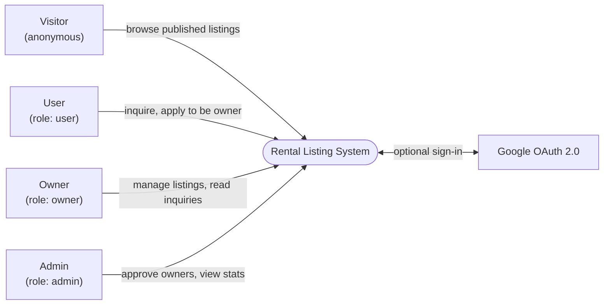
```mermaid
flowchart LR
    V["Visitor<br/>(anonymous)"]
    U["User<br/>(role: user)"]
    O["Owner<br/>(role: owner)"]
    A["Admin<br/>(role: admin)"]
    S(["Rental Listing System"])
    G["Google OAuth 2.0"]

    V -- "browse published listings" --> S
    U -- "inquire, apply to be owner" --> S
    O -- "manage listings, read inquiries" --> S
    A -- "approve owners, view stats" --> S
    S <-- "optional sign-in" --> G
```

### Container architecture

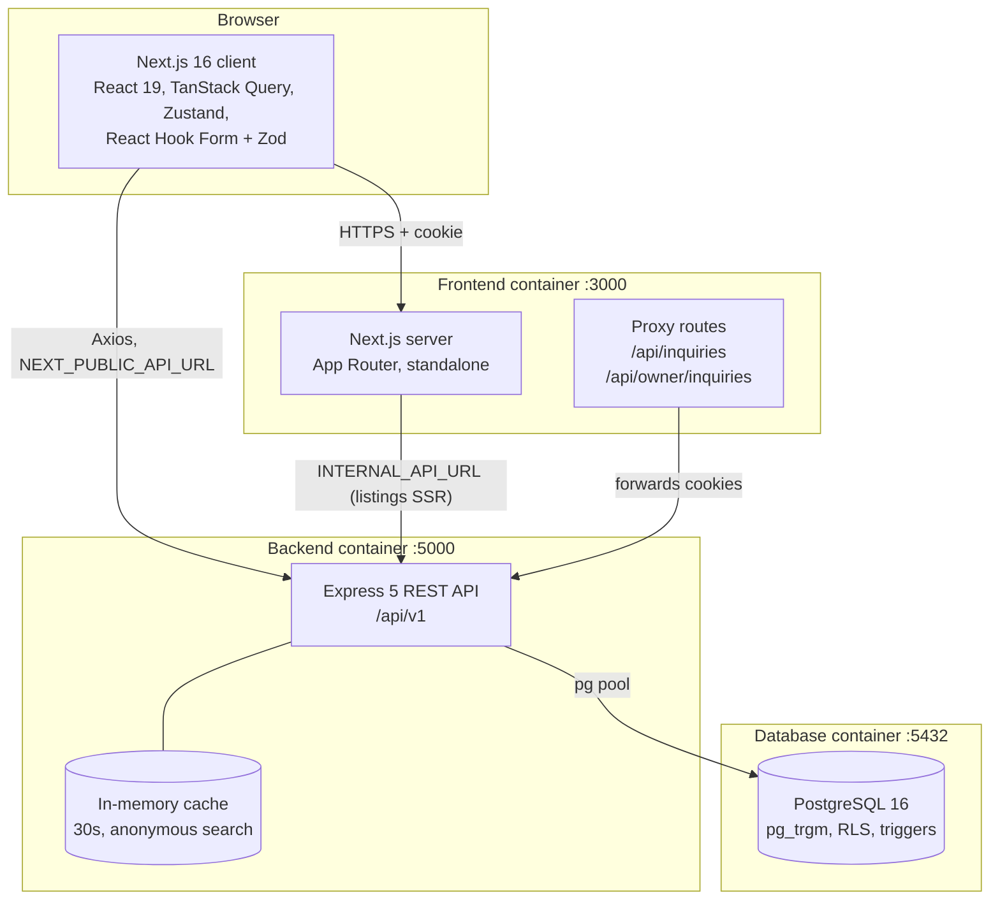
```mermaid
flowchart TB
    subgraph Browser
        UI["Next.js 16 client<br/>React 19, TanStack Query, Zustand,<br/>React Hook Form + Zod"]
    end

    subgraph FE["Frontend container :3000"]
        SSR["Next.js server<br/>App Router, standalone"]
        PX["Proxy routes<br/>/api/inquiries<br/>/api/owner/inquiries"]
    end

    subgraph BE["Backend container :5000"]
        API["Express 5 REST API<br/>/api/v1"]
        CACHE[("In-memory cache<br/>30s, anonymous search")]
    end

    subgraph DBC["Database container :5432"]
        PG[("PostgreSQL 16<br/>pg_trgm, RLS, triggers")]
    end

    UI -- "HTTPS + cookie" --> SSR
    UI -- "Axios, NEXT_PUBLIC_API_URL" --> API
    SSR -- "INTERNAL_API_URL (listings SSR)" --> API
    PX -- "forwards cookies" --> API
    API --- CACHE
    API -- "pg pool" --> PG
```

- The browser talks to the API directly (Axios) for most calls; Next.js proxy routes exist only for inquiry endpoints.
- Server-side rendering of `/listings` fetches from the API using `INTERNAL_API_URL`.
- All authorization is enforced in the API. The UI's `ProtectedRoute` components are a UX convenience, not a security boundary.

### Backend layering

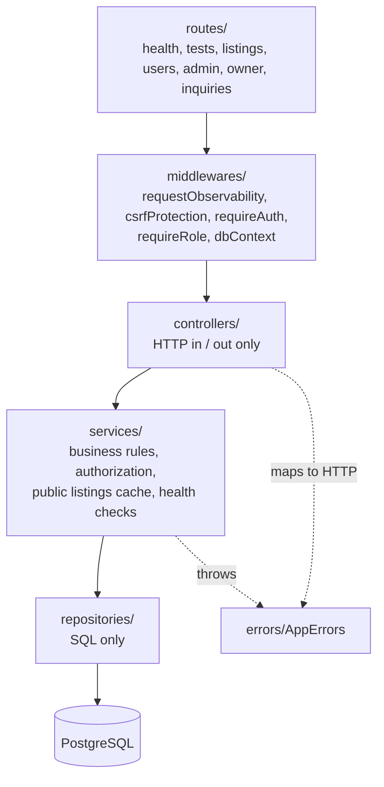
```mermaid
flowchart TB
    R["routes/<br/>health, tests, listings, users, admin, owner, inquiries"]
    M["middlewares/<br/>requestObservability, csrfProtection, requireAuth,<br/>requireRole, dbContext"]
    C["controllers/<br/>HTTP in / out only"]
    SV["services/<br/>business rules, authorization,<br/>public listings cache, health checks"]
    RP["repositories/<br/>SQL only"]
    DB[("PostgreSQL")]
    ER["errors/AppErrors"]

    R --> M --> C --> SV --> RP --> DB
    SV -. throws .-> ER
    C -. maps to HTTP .-> ER
```

| Layer | Owns | Must not |
| --- | --- | --- |
| Routes | Path to middleware chain to controller wiring | Contain logic |
| Middleware | Cross-cutting concerns: auth, CSRF, DB context, timing | Contain business rules |
| Controllers | Parse request, call service, shape response | Run SQL |
| Services | Rules (for example "cannot inquire on own listing"), ownership checks | Know about `req` / `res` |
| Repositories | Parameterized SQL | Make authorization decisions |

### Deployment topologies

**Local / Docker Compose**

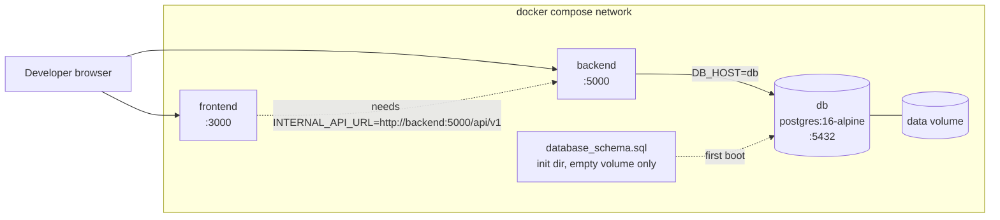
```mermaid
flowchart LR
    subgraph Compose["docker compose network"]
        FEs["frontend<br/>:3000"]
        BEs["backend<br/>:5000"]
        DBs[("db<br/>postgres:16-alpine<br/>:5432")]
        VOL[("data volume")]
        INIT["database_schema.sql<br/>init dir, empty volume only"]
    end

    Dev["Developer browser"] --> FEs
    Dev --> BEs
    FEs -. "needs INTERNAL_API_URL=http://backend:5000/api/v1" .-> BEs
    BEs -- "DB_HOST=db" --> DBs
    DBs --- VOL
    INIT -. first boot .-> DBs
```

**Production (cross-origin: frontend and API on different domains)**

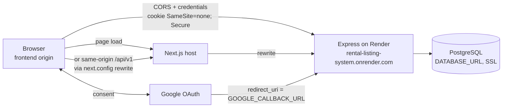
```mermaid
flowchart LR
    B["Browser<br/>frontend origin"]
    FE["Next.js host"]
    API["Express on Render<br/>rental-listing-system.onrender.com"]
    DB[("PostgreSQL<br/>DATABASE_URL, SSL")]
    GO["Google OAuth"]

    B -- "page load" --> FE
    B -- "CORS + credentials<br/>cookie SameSite=none; Secure" --> API
    B -- "or same-origin /api/v1<br/>via next.config rewrite" --> FE
    FE -- "rewrite" --> API
    API --> DB
    B <-- "consent" --> GO
    GO -- "redirect_uri = GOOGLE_CALLBACK_URL" --> API
```

---

## Data flow diagrams (DFD)

### DFD Level 0 (context)

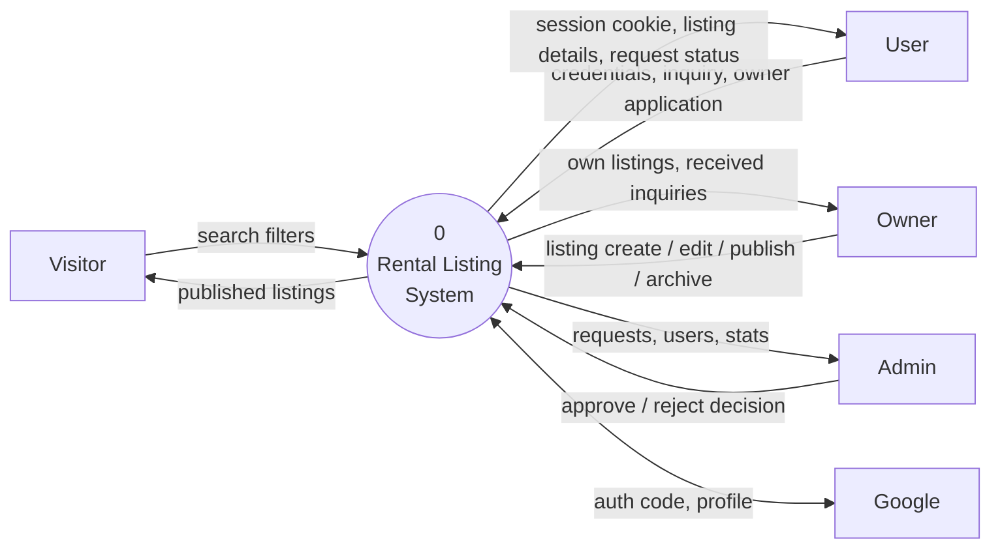
```mermaid
flowchart LR
    VIS["Visitor"]
    USR["User"]
    OWN["Owner"]
    ADM["Admin"]
    GOO["Google"]
    P(("0<br/>Rental Listing<br/>System"))

    VIS -- "search filters" --> P
    P -- "published listings" --> VIS
    USR -- "credentials, inquiry, owner application" --> P
    P -- "session cookie, listing details, request status" --> USR
    OWN -- "listing create / edit / publish / archive" --> P
    P -- "own listings, received inquiries" --> OWN
    ADM -- "approve / reject decision" --> P
    P -- "requests, users, stats" --> ADM
    P <-- "auth code, profile" --> GOO
```

### DFD Level 1

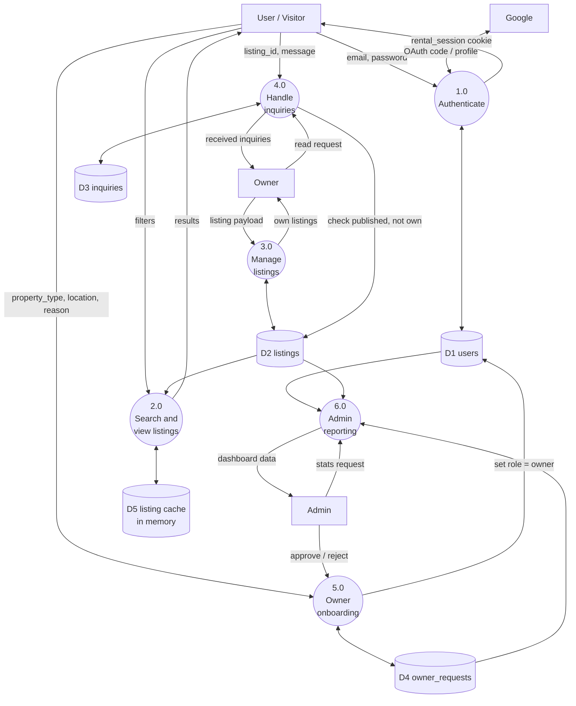
```mermaid
flowchart TB
    USR["User / Visitor"]
    OWN["Owner"]
    ADM["Admin"]
    GOO["Google"]

    P1(("1.0<br/>Authenticate"))
    P2(("2.0<br/>Search and<br/>view listings"))
    P3(("3.0<br/>Manage<br/>listings"))
    P4(("4.0<br/>Handle<br/>inquiries"))
    P5(("5.0<br/>Owner<br/>onboarding"))
    P6(("6.0<br/>Admin<br/>reporting"))

    D1[("D1 users")]
    D2[("D2 listings")]
    D3[("D3 inquiries")]
    D4[("D4 owner_requests")]
    D5[("D5 listing cache<br/>in memory")]

    USR -- "email, password" --> P1
    GOO <-- "OAuth code / profile" --> P1
    P1 <--> D1
    P1 -- "rental_session cookie" --> USR

    USR -- "filters" --> P2
    P2 <--> D5
    D2 --> P2
    P2 -- "results" --> USR

    OWN -- "listing payload" --> P3
    P3 <--> D2
    P3 -- "own listings" --> OWN

    USR -- "listing_id, message" --> P4
    P4 -- "check published, not own" --> D2
    P4 <--> D3
    OWN -- "read request" --> P4
    P4 -- "received inquiries" --> OWN

    USR -- "property_type, location, reason" --> P5
    P5 <--> D4
    ADM -- "approve / reject" --> P5
    P5 -- "set role = owner" --> D1

    ADM -- "stats request" --> P6
    D1 --> P6
    D2 --> P6
    D4 --> P6
    P6 -- "dashboard data" --> ADM
```

### DFD Level 2: search and view listings (process 2.0)

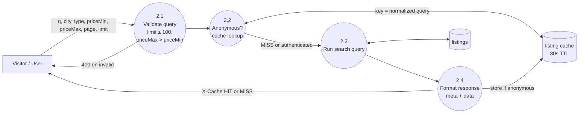
```mermaid
flowchart LR
    USR["Visitor / User"]
    V(("2.1<br/>Validate query<br/>limit ≤ 100,<br/>priceMax > priceMin"))
    K(("2.2<br/>Anonymous?<br/>cache lookup"))
    Q(("2.3<br/>Run search query"))
    F(("2.4<br/>Format response<br/>meta + data"))
    C[("listing cache<br/>30s TTL")]
    L[("listings")]

    USR -- "q, city, type, priceMin, priceMax, page, limit" --> V
    V -- "400 on invalid" --> USR
    V --> K
    K <-- "key = normalized query" --> C
    K -- "MISS or authenticated" --> Q
    Q <--> L
    Q --> F
    F -- "store if anonymous" --> C
    F -- "X-Cache HIT or MISS" --> USR
```

### DFD Level 2: authentication with cross-origin cookie (process 1.0)

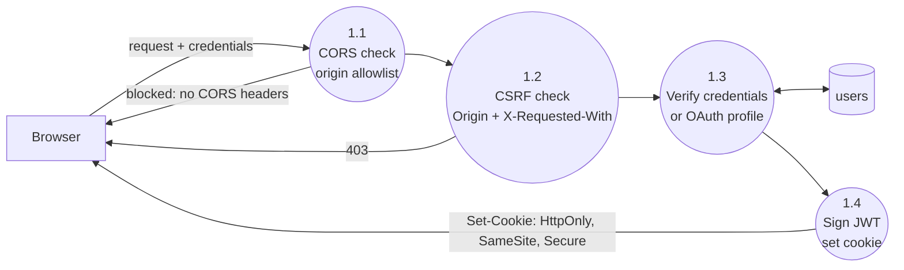
```mermaid
flowchart LR
    B["Browser"]
    CO(("1.1<br/>CORS check<br/>origin allowlist"))
    CS(("1.2<br/>CSRF check<br/>Origin + X-Requested-With"))
    CR(("1.3<br/>Verify credentials<br/>or OAuth profile"))
    TK(("1.4<br/>Sign JWT<br/>set cookie"))
    U[("users")]

    B -- "request + credentials" --> CO
    CO -- "blocked: no CORS headers" --> B
    CO --> CS
    CS -- "403" --> B
    CS --> CR
    CR <--> U
    CR --> TK
    TK -- "Set-Cookie: HttpOnly, SameSite, Secure" --> B
```

---

## Data model

Columns are inferred from the API contract; check against `database_schema.sql`.

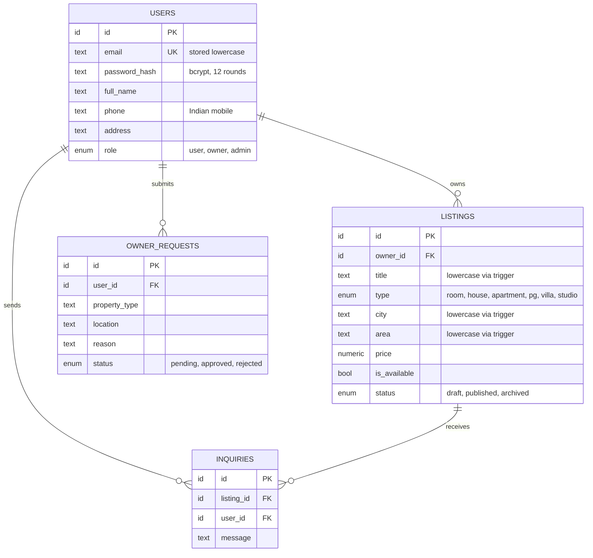
```mermaid
erDiagram
    USERS ||--o{ LISTINGS : owns
    USERS ||--o{ INQUIRIES : sends
    LISTINGS ||--o{ INQUIRIES : receives
    USERS ||--o{ OWNER_REQUESTS : submits

    USERS {
        id id PK
        text email UK "stored lowercase"
        text password_hash "bcrypt, 12 rounds"
        text full_name
        text phone "Indian mobile"
        text address
        enum role "user, owner, admin"
    }
    LISTINGS {
        id id PK
        id owner_id FK
        text title "lowercase via trigger"
        enum type "room, house, apartment, pg, villa, studio"
        text city "lowercase via trigger"
        text area "lowercase via trigger"
        numeric price
        bool is_available
        enum status "draft, published, archived"
    }
    INQUIRIES {
        id id PK
        id listing_id FK
        id user_id FK
        text message
    }
    OWNER_REQUESTS {
        id id PK
        id user_id FK
        text property_type
        text location
        text reason
        enum status "pending, approved, rejected"
    }
```

---

## Low-level design (LLD)

### Middleware chain and request lifecycle

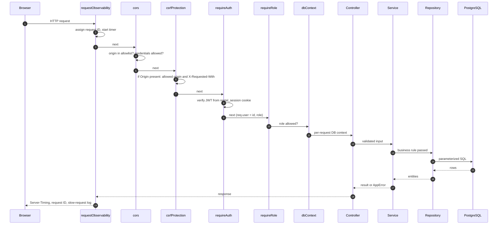
```mermaid
sequenceDiagram
    autonumber
    participant B as Browser
    participant OBS as requestObservability
    participant CORS as cors
    participant CSRF as csrfProtection
    participant AUTH as requireAuth
    participant ROLE as requireRole
    participant CTX as dbContext
    participant CTL as Controller
    participant SVC as Service
    participant REPO as Repository
    participant DB as PostgreSQL

    B->>OBS: HTTP request
    OBS->>OBS: assign request ID, start timer
    OBS->>CORS: next
    CORS->>CORS: origin in allowlist? credentials allowed?
    CORS->>CSRF: next
    CSRF->>CSRF: if Origin present: allowed origin and X-Requested-With
    CSRF->>AUTH: next
    AUTH->>AUTH: verify JWT from rental_session cookie
    AUTH->>ROLE: next (req.user = id, role)
    ROLE->>CTX: role allowed?
    CTX->>CTL: per-request DB context
    CTL->>SVC: validated input
    SVC->>REPO: business rule passed
    REPO->>DB: parameterized SQL
    DB-->>REPO: rows
    REPO-->>SVC: entities
    SVC-->>CTL: result or AppError
    CTL-->>OBS: response
    OBS-->>B: Server-Timing, request ID, slow-request log
```

The exact middleware order should be confirmed against `app.js`.

### Login with email and password

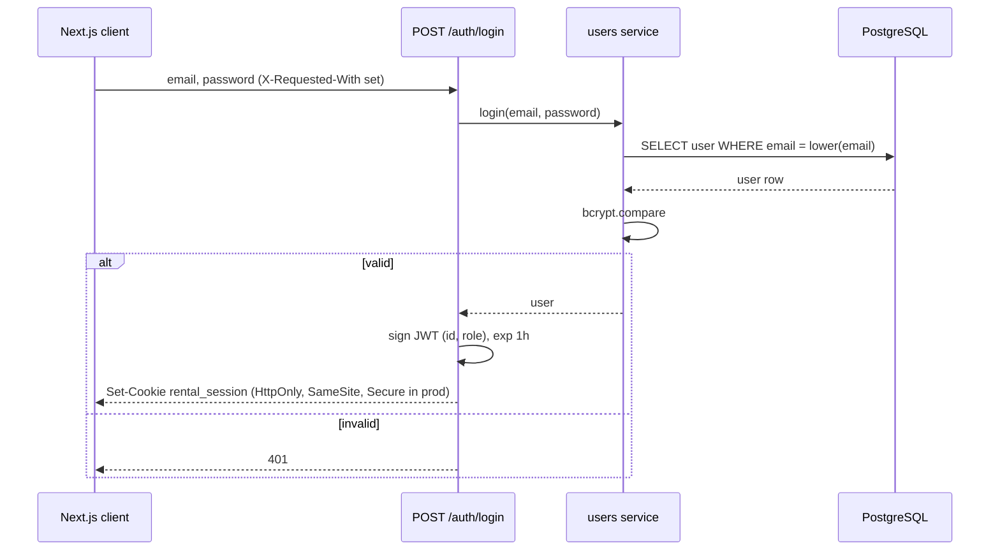
```mermaid
sequenceDiagram
    participant FE as Next.js client
    participant API as POST /auth/login
    participant SVC as users service
    participant DB as PostgreSQL

    FE->>API: email, password (X-Requested-With set)
    API->>SVC: login(email, password)
    SVC->>DB: SELECT user WHERE email = lower(email)
    DB-->>SVC: user row
    SVC->>SVC: bcrypt.compare
    alt valid
        SVC-->>API: user
        API->>API: sign JWT (id, role), exp 1h
        API-->>FE: Set-Cookie rental_session (HttpOnly, SameSite, Secure in prod)
    else invalid
        API-->>FE: 401
    end
```

### Google OAuth 2.0 (hand-rolled)

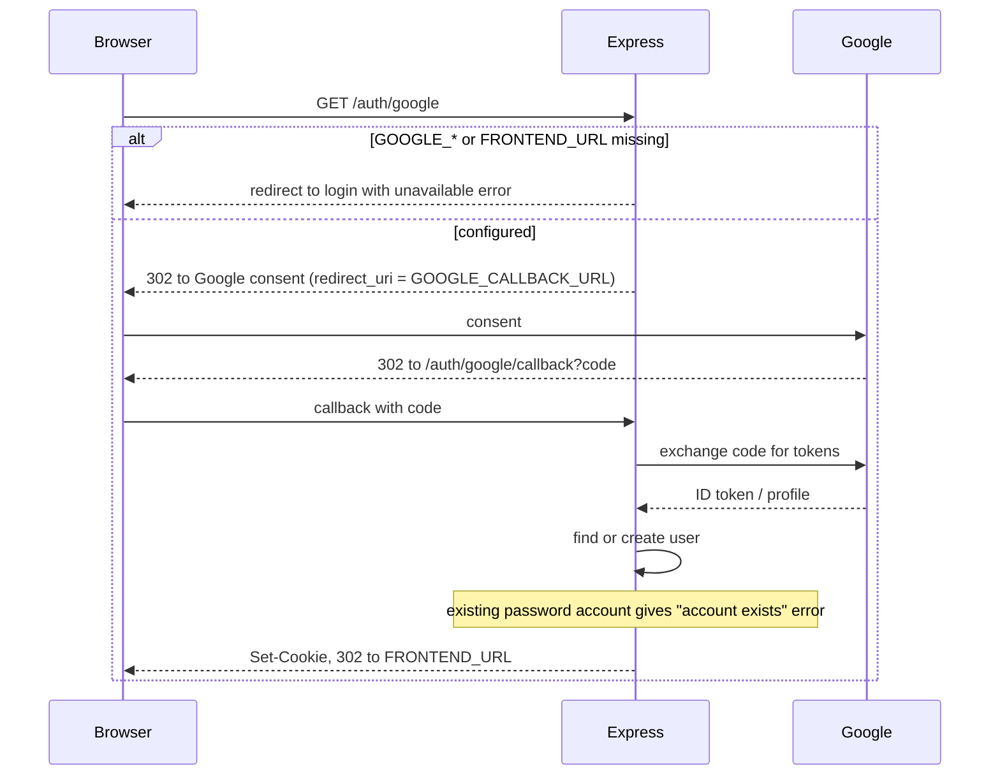
```mermaid
sequenceDiagram
    participant B as Browser
    participant API as Express
    participant G as Google

    B->>API: GET /auth/google
    alt GOOGLE_* or FRONTEND_URL missing
        API-->>B: redirect to login with unavailable error
    else configured
        API-->>B: 302 to Google consent (redirect_uri = GOOGLE_CALLBACK_URL)
        B->>G: consent
        G-->>B: 302 to /auth/google/callback?code
        B->>API: callback with code
        API->>G: exchange code for tokens
        G-->>API: ID token / profile
        API->>API: find or create user
        Note over API: existing password account gives "account exists" error
        API-->>B: Set-Cookie, 302 to FRONTEND_URL
    end
```

### Become owner and admin approval

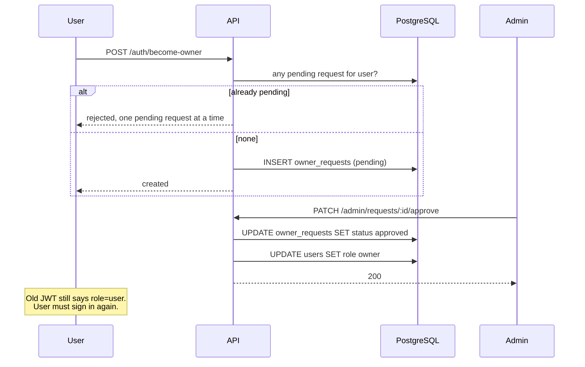
```mermaid
sequenceDiagram
    participant U as User
    participant API as API
    participant DB as PostgreSQL
    participant A as Admin

    U->>API: POST /auth/become-owner
    API->>DB: any pending request for user?
    alt already pending
        API-->>U: rejected, one pending request at a time
    else none
        API->>DB: INSERT owner_requests (pending)
        API-->>U: created
    end
    A->>API: PATCH /admin/requests/:id/approve
    API->>DB: UPDATE owner_requests SET status approved
    API->>DB: UPDATE users SET role owner
    API-->>A: 200
    Note over U: Old JWT still says role=user.<br/>User must sign in again.
```

### Anonymous listing search with cache

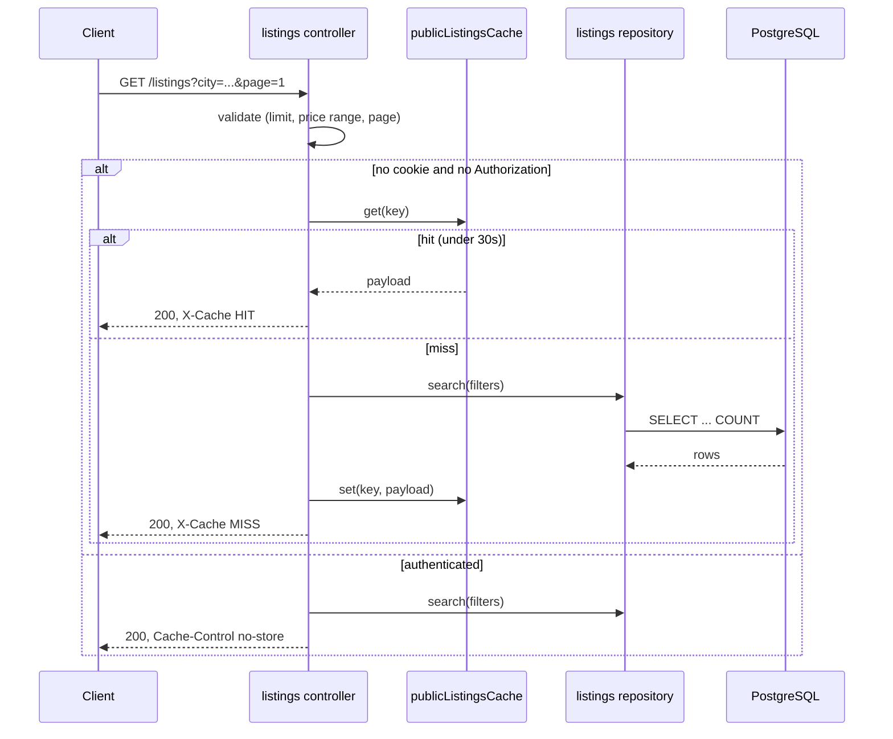
```mermaid
sequenceDiagram
    participant C as Client
    participant CTL as listings controller
    participant CA as publicListingsCache
    participant REPO as listings repository
    participant DB as PostgreSQL

    C->>CTL: GET /listings?city=...&page=1
    CTL->>CTL: validate (limit, price range, page)
    alt no cookie and no Authorization
        CTL->>CA: get(key)
        alt hit (under 30s)
            CA-->>CTL: payload
            CTL-->>C: 200, X-Cache HIT
        else miss
            CTL->>REPO: search(filters)
            REPO->>DB: SELECT ... COUNT
            DB-->>REPO: rows
            CTL->>CA: set(key, payload)
            CTL-->>C: 200, X-Cache MISS
        end
    else authenticated
        CTL->>REPO: search(filters)
        CTL-->>C: 200, Cache-Control no-store
    end
```

### Listing state machine

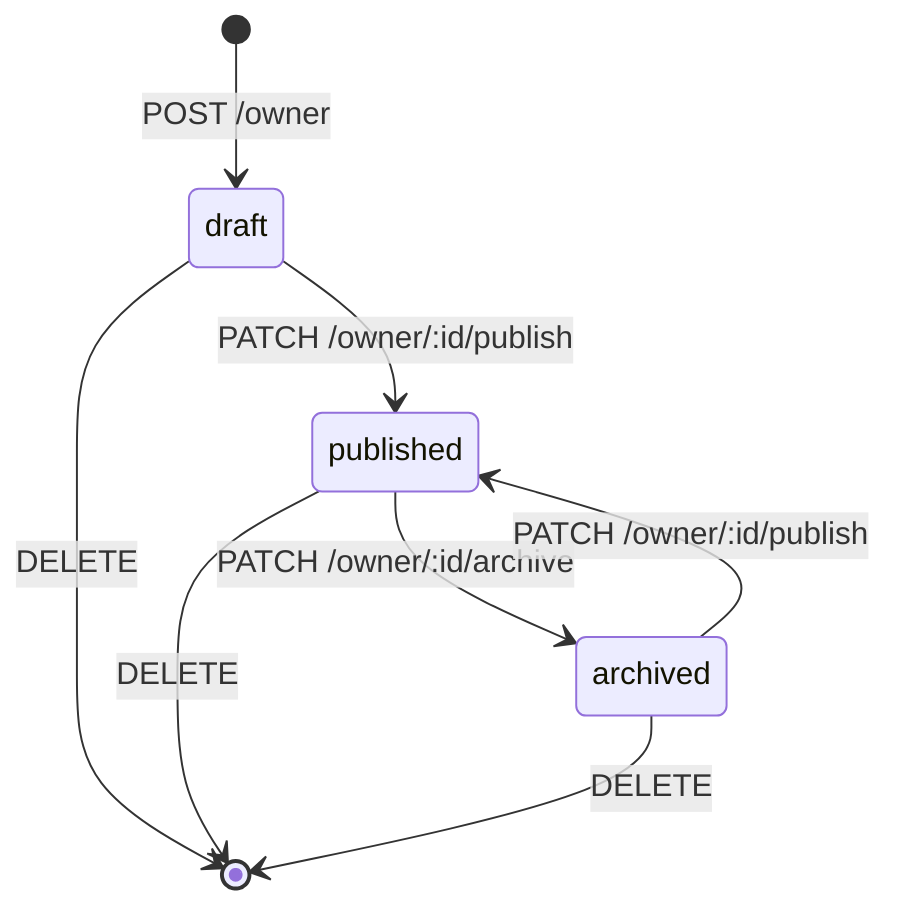
```mermaid
stateDiagram-v2
    [*] --> draft: POST /owner
    draft --> published: PATCH /owner/:id/publish
    published --> archived: PATCH /owner/:id/archive
    archived --> published: PATCH /owner/:id/publish
    draft --> [*]: DELETE
    published --> [*]: DELETE
    archived --> [*]: DELETE
```

Only `published` listings appear in public search and accept inquiries.

### Owner request state machine

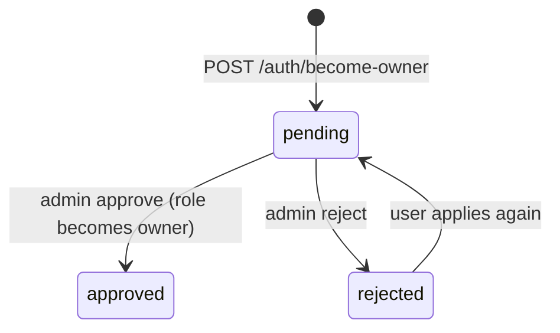
```mermaid
stateDiagram-v2
    [*] --> pending: POST /auth/become-owner
    pending --> approved: admin approve (role becomes owner)
    pending --> rejected: admin reject
    rejected --> pending: user applies again
```

### Module view (backend)

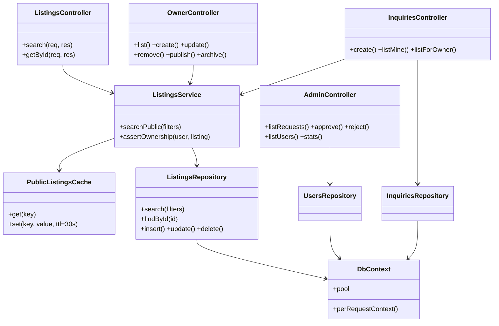
```mermaid
classDiagram
    class ListingsController {
        +search(req, res)
        +getById(req, res)
    }
    class OwnerController {
        +list() +create() +update()
        +remove() +publish() +archive()
    }
    class InquiriesController {
        +create() +listMine() +listForOwner()
    }
    class AdminController {
        +listRequests() +approve() +reject()
        +listUsers() +stats()
    }
    class ListingsService {
        +searchPublic(filters)
        +assertOwnership(user, listing)
    }
    class PublicListingsCache {
        +get(key)
        +set(key, value, ttl=30s)
    }
    class ListingsRepository {
        +search(filters)
        +findById(id)
        +insert() +update() +delete()
    }
    class UsersRepository
    class InquiriesRepository
    class DbContext {
        +pool
        +perRequestContext()
    }

    ListingsController --> ListingsService
    OwnerController --> ListingsService
    InquiriesController --> ListingsService
    ListingsService --> PublicListingsCache
    ListingsService --> ListingsRepository
    AdminController --> UsersRepository
    InquiriesController --> InquiriesRepository
    ListingsRepository --> DbContext
    UsersRepository --> DbContext
    InquiriesRepository --> DbContext
```

Names are illustrative of the structure; rename to match the actual files.

### Frontend structure

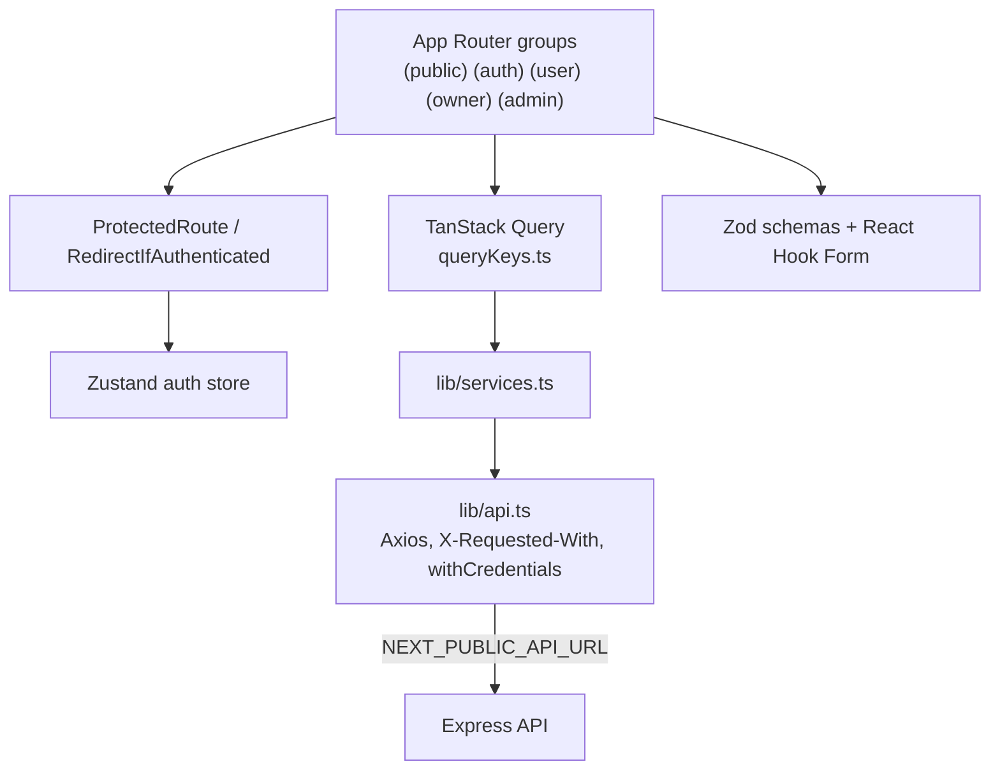
```mermaid
flowchart TB
    RG["App Router groups<br/>(public) (auth) (user) (owner) (admin)"]
    PR["ProtectedRoute / RedirectIfAuthenticated"]
    ST["Zustand auth store"]
    TQ["TanStack Query<br/>queryKeys.ts"]
    SV["lib/services.ts"]
    AX["lib/api.ts<br/>Axios, X-Requested-With, withCredentials"]
    ZD["Zod schemas + React Hook Form"]

    RG --> PR --> ST
    RG --> TQ --> SV --> AX
    RG --> ZD
    AX -- "NEXT_PUBLIC_API_URL" --> API["Express API"]
```

---

## Architecture decision records

### ADR-001: Separate Express API instead of Next.js route handlers
- **Context:** Three roles, a relational model, operational endpoints (health, readiness).
- **Decision:** Standalone Express 5 REST API; Next.js is the client plus a few cookie-forwarding proxy routes.
- **Consequences:** Testable with Supertest and Postman, independently deployable. Cost: two deployables, CORS and CSRF to manage, `NEXT_PUBLIC_API_URL` baked at build time. This decision is the root of the CORS and cookie problems in case studies 2 and 3.

### ADR-002: Layered backend (routes, controllers, services, repositories)
- **Decision:** SQL only in repositories, rules only in services, HTTP only in controllers.
- **Consequences:** Authorization rules live in one place per feature. Cost: more files per feature.

### ADR-003: JWT in an HTTP-only cookie, 1 hour, no refresh
- **Alternatives:** JWT in `localStorage`, server-side sessions.
- **Decision:** HTTP-only cookie `rental_session`, `SameSite=lax` by default, `Secure` in production, configurable via `COOKIE_SAME_SITE`.
- **Consequences:** Token is unreadable by JavaScript, which limits XSS damage. Cost: cookies are sent automatically so CSRF protection is needed (ADR-004), cross-site deployment needs `SameSite=none` (case study 3), no revocation, and role changes need re-login (case study 5).

### ADR-004: Custom CSRF defence via Origin check and `X-Requested-With`
- **Decision:** Non-GET requests carrying an `Origin` must come from an allowed origin and include `X-Requested-With: XMLHttpRequest`. Requests without `Origin` (curl) pass.
- **Consequences:** No token-sync machinery. The custom header also forces a CORS preflight, so it must be in the CORS allowed headers (case study 2).

### ADR-005: Explicit CORS allowlist with credentials
- **Decision:** Allowed origins are `localhost:3000`, `127.0.0.1:3000`, `FRONTEND_URL` and `CORS_ORIGINS`. No wildcard, because credentialed requests cannot use `*`.
- **Consequences:** Every new frontend domain (preview deploys, custom domain) must be added to env config.

### ADR-006: Hand-rolled Google OAuth 2.0, no SDK
- **Decision:** Implement the authorization-code flow directly.
- **Consequences:** No extra dependency and full control of error redirects. Cost: you own redirect URI handling and state validation (case study 4).

### ADR-007: PostgreSQL with RLS policies and application-level checks
- **Decision:** Define RLS and a `rental_app` role in the schema, and also enforce role and ownership in services.
- **Consequences:** The app connects as `DB_USER`; superusers bypass RLS, so application checks are the effective control today. Next step: connect as a non-superuser and `SET ROLE rental_app` per request.

### ADR-008: Normalize text to lowercase in DB triggers
- **Decision:** `title`, `type`, `city`, `area` and emails are lowercased by triggers.
- **Consequences:** Case-insensitive search and unique emails from any client. Original casing is lost, so the UI re-capitalizes for display.

### ADR-009: `pg_trgm` plus targeted indexes for listing search
- **Decision:** Trigram index for `q`; composite indexes for city, type and price, shipped as `20261113_listing_query_indexes.sql`.
- **Consequences:** Fast fuzzy search without an external engine. Migrations are applied manually.

### ADR-010: 30-second in-memory cache for anonymous searches only
- **Decision:** Cache only requests with no cookie or `Authorization` header; authenticated responses are `no-store`.
- **Consequences:** Absorbs repeat public traffic without Redis. Per-process, so not shared across instances; up to 30 seconds stale.

### ADR-011: Role stored in the JWT
- **Decision:** `requireRole` reads the role from the token with no DB lookup.
- **Consequences:** Zero extra queries per request. Role changes apply only after re-login (case study 5).

### ADR-012: Narrow product scope
- **Decision:** No payments, bookings, photos, descriptions or two-way messaging.
- **Consequences:** Keeps the domain small enough to get authorization, performance and operations right.

---

## Bug-fix case studies

These follow the problems hit when moving from local development to a deployed split frontend/API setup. Commands, error strings and variable names come from the project's configuration. Fill in the **Evidence** rows with your own commit hashes, screenshots and timings.

### Case study 1: CORS failures after deploying to production

| | |
| --- | --- |
| **Symptom** | Everything worked on `localhost:3000`. After deploying the frontend and the API on different domains, every API call from the browser failed. DevTools showed a CORS error and the request never reached the controllers. |
| **Why it was confusing** | `curl` and Postman worked fine, because CORS is enforced only by browsers. The API itself was healthy: `/health/live` returned 200. |
| **Investigation** | Compared the failing request's `Origin` header with the allowlist. Only `http://localhost:3000` and `http://127.0.0.1:3000` are always allowed, so the production domain was rejected. Checked the preflight (`OPTIONS`) response separately from the real request. |
| **Root causes** | (1) The production frontend origin was not in the allowlist because `FRONTEND_URL` and `CORS_ORIGINS` were unset on the host. (2) Credentialed requests (`withCredentials`) cannot use `Access-Control-Allow-Origin: *`; the origin must match exactly, including scheme and no trailing slash. (3) The frontend sends the custom `X-Requested-With` header, which triggers a preflight, so it must be listed in the allowed headers and `OPTIONS` must be answered before the CSRF and auth middleware reject it. |
| **Fix** | Set `FRONTEND_URL` to the exact production origin and add extra domains to `CORS_ORIGINS`. Keep `credentials: true` with an explicit origin list. Allow `X-Requested-With` and `Content-Type` in allowed headers. Make sure the CORS middleware runs before CSRF and auth. |
| **Lesson** | CORS is a browser contract, not an API property. Test the preflight explicitly, and treat the origin allowlist as deploy-time configuration that every new domain (including preview deployments) must be added to. |
| **Evidence** | Commit: `<hash>` · Screenshot of the failing preflight and the fixed response headers |

### Case study 2: Login succeeded but the session cookie never stuck

| | |
| --- | --- |
| **Symptom** | `POST /auth/login` returned 200 with the user, but the very next call to `/auth/me` returned 401. The user appeared to be logged out immediately. It worked locally. |
| **Investigation** | Inspected the `Set-Cookie` header in the login response and the Application tab in DevTools: the cookie was either missing or marked as blocked, and `/auth/me` carried no `rental_session`. |
| **Root causes** | (1) Locally the frontend and API are both on `localhost`, which browsers treat as same-site. In production they are different sites, and the default `SameSite=lax` cookie is not sent on cross-site `fetch`/XHR requests. (2) `SameSite=none` is only accepted if the cookie is also `Secure`, which requires HTTPS; the code forces `Secure` for `none`, and `NODE_ENV=production` also makes cookies `Secure`. (3) Behind a hosting proxy such as Render, Express sees plain HTTP unless `trust proxy` is configured, which can stop `Secure` cookies from being set. **(confirm which of these you actually hit)** (4) The client must send `withCredentials: true`. |
| **Fix** | Set `COOKIE_SAME_SITE=none` and `NODE_ENV=production` on the API so cookies are `SameSite=None; Secure`. Serve both sides over HTTPS. Enable `app.set('trust proxy', 1)` if running behind a proxy. Keep `withCredentials: true` in `lib/api.ts`. Added `authCookies` tests to lock the attributes in. |
| **Alternative considered** | Use the Next.js rewrite (`/api/v1/*` to the API) so the browser only talks to one origin and `lax` cookies work. Trade-off: all API traffic goes through the Next.js server, and an unset `NEXT_PUBLIC_API_URL` silently points a local frontend at the deployed API. |
| **Lesson** | A cookie works only if its attributes, the transport (HTTPS, proxy headers) and the client flags (`withCredentials`) all agree. Cookies behave differently on same-site and cross-site setups, so test in an environment that matches production. |
| **Evidence** | `backend/tests/authCookies.test.js`, commit: `<hash>` · Screenshot of `Set-Cookie` before and after |

### Case study 3: CORS and cookies interacting (why fixing one exposed the other)

| | |
| --- | --- |
| **Symptom** | After the CORS fix, requests reached the API but authenticated routes still failed; after the cookie fix, a different origin (preview or `www` variant) failed with CORS again. |
| **Root cause** | The two problems share one requirement: with credentials, the browser needs an exact-origin CORS response **and** a cookie whose `SameSite`/`Secure` attributes allow the cross-site send. Fixing only one leaves the request failing for the other reason, and the symptom looks the same (unauthenticated). |
| **Fix** | Treated them as one configuration set and documented it: `FRONTEND_URL`, `CORS_ORIGINS`, `COOKIE_SAME_SITE`, `NODE_ENV`, HTTPS on both sides, `withCredentials` on the client. Added the combination to the README's configuration tables. |
| **Debug checklist** | 1. Does the preflight return the exact origin and `Access-Control-Allow-Credentials: true`? 2. Does the login response set the cookie, and does DevTools show it stored? 3. Does the next request send it? 4. Does `requireAuth` accept it? Failures at each step have different causes. |
| **Lesson** | When two layers fail with the same symptom, debug them in request order rather than guessing. |

### Case study 4: Google OAuth 2.0 failing in production

| | |
| --- | --- |
| **Symptom** | "Continue with Google" worked locally, but in production it either showed Google's `redirect_uri_mismatch` page, bounced back to the login screen with an "unavailable" error, or returned to the frontend still signed out. |
| **Root causes** | (1) `GOOGLE_CALLBACK_URL` is the `redirect_uri` sent to Google and must match, character for character, a URI registered in the Google Cloud console. The local `http://localhost:5000/...` URI was registered, but not the deployed `https://.../api/v1/auth/google/callback`. (2) The flow is hand-rolled and requires all of `GOOGLE_CLIENT_ID`, `GOOGLE_CLIENT_SECRET`, `GOOGLE_CALLBACK_URL` and `FRONTEND_URL`; if any is missing, `/auth/google` redirects to the login page with an "unavailable" error. This is intentional graceful degradation, but it hid a missing env var. (3) The session cookie is set by the API during the callback and then the browser is redirected to the frontend, so the cross-site cookie rules from case study 2 apply here too. (4) Users who had registered with a password hit an "account exists" error, because accounts are not linked automatically. |
| **Fix** | Registered the production callback URL in Google Cloud, set all four env vars on the API, matched `FRONTEND_URL` exactly for the final redirect, and applied the `SameSite=none; Secure` cookie settings. Documented that Compose does not pass `GOOGLE_*` to the backend. |
| **Remaining work** | Account linking for existing password users; confirm that a `state` parameter is generated and checked on callback to prevent login CSRF. |
| **Lesson** | OAuth failures are almost always configuration mismatches between three parties (Google console, API env, frontend URL). Exact-string redirect URIs are strict by design. Surface "feature disabled by missing config" in logs rather than only in the UI. |
| **Evidence** | Commit: `<hash>` · Screenshot of the Google console redirect URIs (redact the client ID) |

### Case study 5: Approved owner still got 403

| | |
| --- | --- |
| **Symptom** | An admin approved an owner request, but the user still could not create listings. |
| **Root cause** | The role is embedded in the 1-hour JWT. Approval updated the database, but the user's existing token still said `user`. |
| **Fix (current)** | Documented: sign in again after approval. |
| **Better options** | Re-read the role from the DB in `requireRole` (one extra query per request, instant effect and revocation); or issue short-lived access tokens with refresh tokens. |
| **Lesson** | Putting authorization claims in a token trades freshness for speed. Make that choice deliberately and reflect it in the UX. |

### Case study 6: Slow listing search

| | |
| --- | --- |
| **Symptom** | `/listings` with `q`, `city`, `type` and price filters slowed down as data grew. |
| **Investigation** | `npm run verify:db` (`EXPLAIN ANALYZE` of the real listing queries), `npm run verify:perf` against a running stack, plus slow-query logging and `Server-Timing` headers. |
| **Root cause** | Sequential scans on text filters and fuzzy search without a supporting index. |
| **Fix** | Enabled `pg_trgm`, added indexes in `src/migrations/20261113_listing_query_indexes.sql`, added the 30-second anonymous cache, capped `limit` at 100 and rejected invalid pages and price ranges early. |
| **Result** | Record before/after query plans (Seq Scan to index scan) and p95 latency here. |
| **Lesson** | Measure with the real query plan first, and keep the verification scripts so regressions are catchable. |
| **Evidence** | `docs/PERFORMANCE_VERIFICATION.md`, commit: `<hash>` |

### Case study 7: Server-side fetch works locally, fails in Docker

| | |
| --- | --- |
| **Symptom** | `/listings` rendered empty or errored under `docker compose`, but worked with `npm run dev`. |
| **Root cause** | The server-rendered page fetches from `INTERNAL_API_URL`, falling back to `http://localhost:5000`. Inside the frontend container `localhost` is the container itself. Compose also does not pass `INTERNAL_API_URL`, `FRONTEND_URL`, `CORS_ORIGINS` or `GOOGLE_*`. |
| **Fix** | Add `INTERNAL_API_URL=http://backend:5000/api/v1` to the frontend service and pass the missing variables to the backend service. |
| **Status** | Diagnosed from the code, not yet run. Apply, test and update this row. |
| **Lesson** | Browser-side and server-side code live in different network namespaces and need different base URLs. |

### Case study 8: Local frontend silently talking to production

| | |
| --- | --- |
| **Symptom** | The local UI showed data that was not in the local database. |
| **Root cause** | Without `NEXT_PUBLIC_API_URL`, the client uses `/api/v1`, which `next.config.mjs` rewrites to the deployed Render API. |
| **Fix** | Always set `NEXT_PUBLIC_API_URL=http://localhost:5000/api/v1` in `frontend/.env.local`; consider failing fast in development when it is unset. |
| **Lesson** | Silent fallbacks to a real environment are dangerous in development. |

---

## Open improvements

| Item | Why |
| --- | --- |
| Wire in `express-rate-limit` on `/auth/login` and `/auth/register` | Brute-force protection; the dependency is already installed |
| Connect as a non-superuser and `SET ROLE rental_app` | Makes RLS an effective second layer |
| Add a migration tool with tracking | Replaces manual SQL and the non-idempotent schema file |
| Remove or gate `/test/error` in production | Avoid shipping a deliberate-failure route |
| Remove unused Neon packages and files | Smaller attack surface and bundle |
| Set `typescript.ignoreBuildErrors` to `false` | A green build should mean the code type-checks |
| Verify OAuth `state` handling and link Google to existing accounts | Login CSRF protection and fewer "account exists" dead ends |
