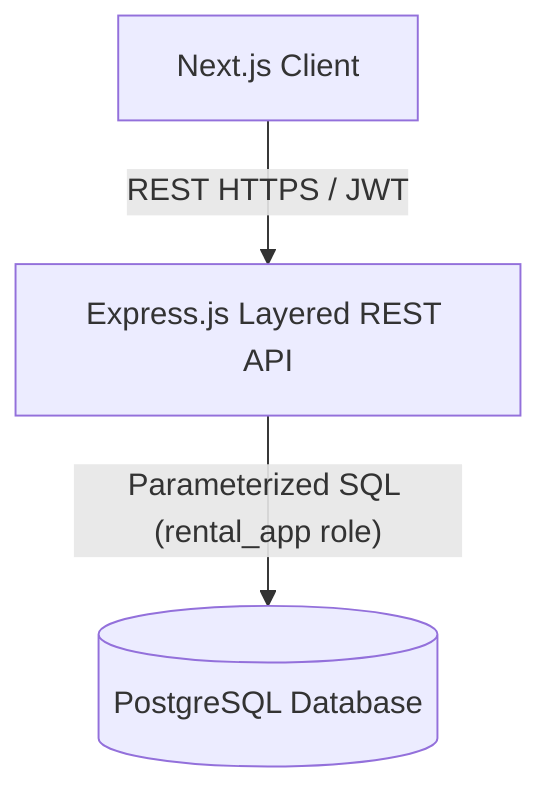
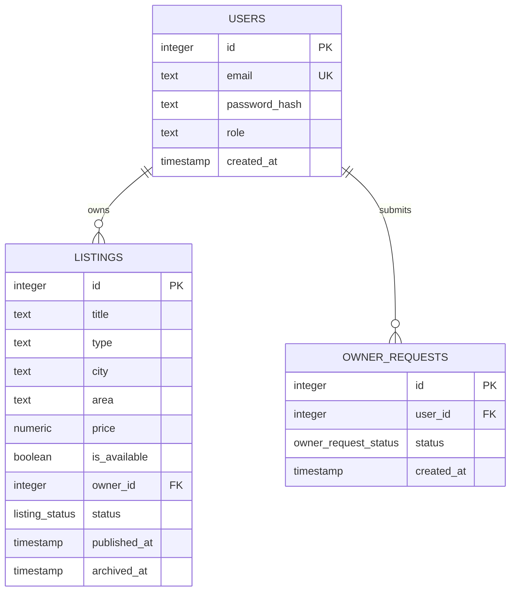
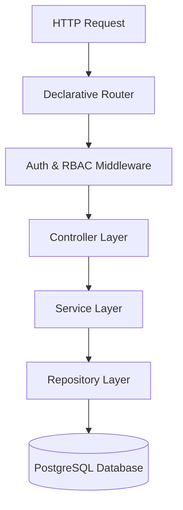
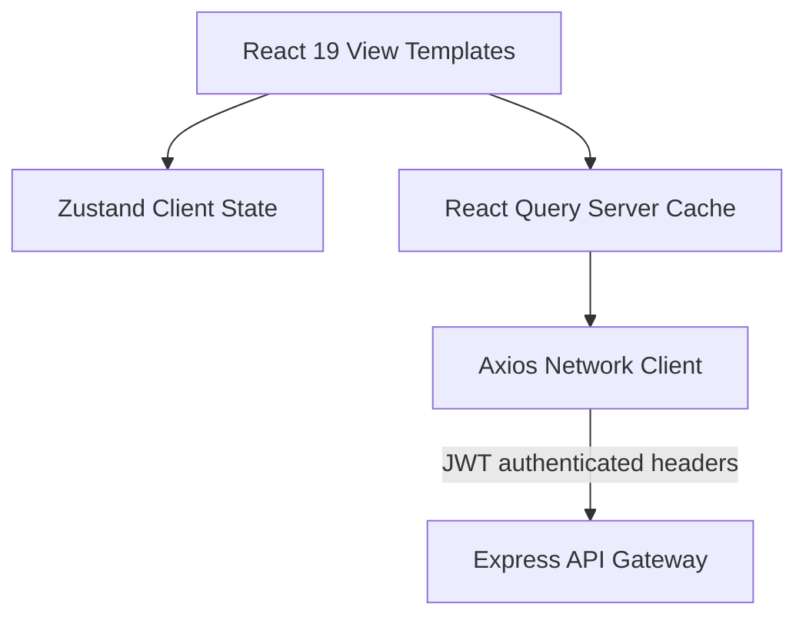
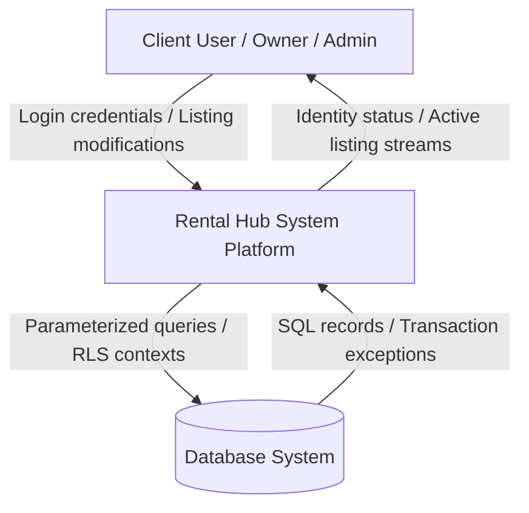
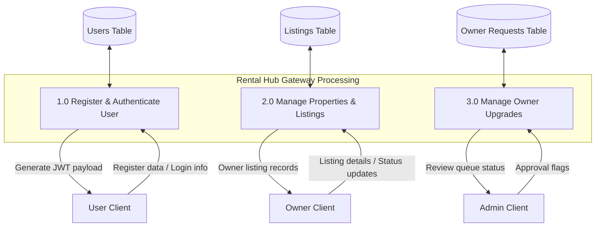

# SYSTEM ARCHITECTURE & TECHNICAL SPECIFICATION - RENTAL HUB

This document provides a comprehensive technical specification and architectural overview of the Rental Hub platform. It describes the design patterns, data constraints, security bounds, and integration layers implemented across the database, backend, and frontend tiers.

---

## 1. SYSTEM OVERVIEW

Rental Hub is an enterprise-grade, role-based property management system designed to coordinate workflows between standard tenants (Users), property managers (Owners), and system moderators (Admins). The application is structured as a decoupled monorepo, utilizing a PostgreSQL relational database with fine-grained row-level access control, a layered Express.js REST API backend, and a modern Next.js client dashboard.



---

## 2. DATABASE LAYER ARCHITECTURE

The relational model is designed in PostgreSQL, enforcing transactional integrity, data type sanitization triggers, unique constraints, and strict Row Level Security (RLS) gates.

### 2.1 Database Schema Diagram



### 2.2 Tables and Entity Definitions

#### 2.2.1 Users Table (`public.users`)
* **Purpose:** Manages identity records and permission assignments.
* **Fields:**
  * `id` (integer, Primary Key, Auto-incrementing sequence)
  * `email` (text, Unique Constraint, lowercased via database trigger)
  * `password_hash` (text, stores salted bcrypt passwords)
  * `role` (text, checked via constraint to be `user`, `owner`, or `admin`)
  * `created_at` (timestamp, defaults to current time)

#### 2.2.2 Listings Table (`public.listings`)
* **Purpose:** Stores property advertisements and availability details.
* **Fields:**
  * `id` (integer, Primary Key)
  * `title` (text, lowercased via trigger)
  * `type` (text, checked to contain `room`, `house`, `apartment`, `pg`, `villa`, or `studio`)
  * `city` (text, lowercased via trigger)
  * `area` (text, nullable, lowercased via trigger)
  * `price` (numeric, checked to ensure value > 0)
  * `is_available` (boolean, defaults to true)
  * `owner_id` (integer, Foreign Key pointing to `users.id` with cascade deletion)
  * `status` (listing_status custom enum: `draft`, `published`, `archived`)
  * `published_at` (timestamp, checked to ensure presence if status is `published`)
  * `archived_at` (timestamp, checked to ensure presence if status is `archived`)

#### 2.2.3 Owner Requests Table (`public.owner_requests`)
* **Purpose:** Tracks tenant applications upgrading to Property Owner permission status.
* **Fields:**
  * `id` (integer, Primary Key)
  * `user_id` (integer, Foreign Key pointing to `users.id` with cascade deletion)
  * `status` (owner_request_status custom enum: `pending`, `approved`, `rejected`)
  * `created_at` (timestamp, defaults to current time)

### 2.3 Data Consistency and Sanitization Triggers
* **Email Normalization Trigger:** Automatically lowercases all inserted or updated email addresses in `users` via the `force_email_lowercase()` function.
* **Listing Text Normalization Trigger:** Lowercases `title`, `type`, `city`, and `area` fields during inserts or updates in `listings` via `force_listings_text_lowercase()`.
* **Pending Request Limit Index:** A unique partial B-tree index `unique_pending_owner_request` restricts users to at most one pending owner upgrade request at any time:
  ```sql
  CREATE UNIQUE INDEX unique_pending_owner_request 
  ON public.owner_requests (user_id) 
  WHERE (status = 'pending'::public.owner_request_status);
  ```

### 2.4 Row Level Security (RLS) Policies
To implement enterprise-grade multi-tenant data boundaries, Row Level Security is enabled on all tables. The application database user (`rental_app`) establishes sessions by passing the active user context via local runtime parameters (`app.user_id` and `app.user_role`) before executing queries within a transaction block.

| Target Table | Policy Name | Access Type | Enforced SQL Constraint |
| :--- | :--- | :---: | :--- |
| **users** | `users_admin_read` | SELECT | `current_setting('app.user_role') = 'admin'` |
| **users** | `users_admin_update` | UPDATE | `current_setting('app.user_role') = 'admin'` |
| **users** | `users_self_read` | SELECT | `id = current_setting('app.user_id')::integer` |
| **listings** | `listings_admin_all` | ALL | `current_setting('app.user_role') = 'admin'` |
| **listings** | `listings_public_read` | SELECT | `status = 'published'` |
| **listings** | `listings_owner_read` | SELECT | `owner_id = current_setting('app.user_id')::integer` |
| **listings** | `listings_owner_insert` | INSERT | `owner_id = current_setting('app.user_id')::integer` |
| **listings** | `listings_owner_update` | UPDATE | `owner_id = current_setting('app.user_id')::integer` |
| **listings** | `listings_owner_delete` | DELETE | `owner_id = current_setting('app.user_id')::integer` |
| **owner_requests** | `requests_admin_all` | ALL | `current_setting('app.user_role') = 'admin'` |
| **owner_requests** | `requests_user_read` | SELECT | `user_id = current_setting('app.user_id')::integer` |
| **owner_requests** | `requests_user_insert` | INSERT | `user_id = current_setting('app.user_id')::integer` |

---

## 3. BACKEND API LAYER ARCHITECTURE

The backend API is engineered in Node.js and Express.js, following a strict Layered Separation of Concerns architecture pattern. This decouples HTTP communication details from the database access operations.



### 3.1 Architectural Layers

1. **Declarative Router:** Specifies API endpoints and intercepts incoming traffic with global validation and role-based guards.
2. **Auth & RBAC Middleware:** Decodes JSON Web Tokens (JWT), extracts caller claims, checks role allowances, and assigns transaction parameters to the active database connection context.
3. **Controller Layer:** Coordinates input parsing, ensures sanitization, and structures standardized REST JSON responses.
4. **Service Layer:** Houses the core business rules, conditional logic, verification sequences, and application state transitions.
5. **Repository Layer:** Encapsulates node-postgres client adapters and issues parameterized SQL queries to enforce security against injection vulnerabilities.
6. **Centralized Error Handling:** Standardizes system operational errors via customized exceptions, formatting stack traces securely during development and suppressing leaking database messages in production.

### 3.2 Gateway REST API Endpoints

#### 3.2.1 Identity and Authentication (`/api/v1/auth`)
* `POST /auth/register` - Registers standard tenant accounts.
* `POST /auth/login` - Validates credentials, issues JWT tokens, and returns active user scopes.
* `GET /auth/profile` - Fetches authenticated user account parameters.

#### 3.2.2 Public and Managed Properties (`/api/v1/listings`)
* `GET /listings` - Public endpoint listing available properties (applies pagination, search strings, and filter variables).
* `GET /listings/:id` - Detailed property records view.
* `POST /listings` - Saves new listing models (Requires Property Owner or Admin roles).
* `PUT /listings/:id` - Modifies listing records (Enforces ownership verification).
* `DELETE /listings/:id` - Archives or removes listings from search grids.

#### 3.2.3 Owner Permissions Lifecycle (`/api/v1/owner`)
* `POST /owner/request` - Requests upgrade to Property Owner permission status.
* `GET /owner/request/status` - Checks active application process details.

#### 3.2.4 System Operations and Moderation (`/api/v1/admin`)
* `GET /admin/requests` - Lists all pending tenant upgrade requests.
* `PUT /admin/requests/:id` - Resolves request statuses (Approves or rejects owner permissions).
* `POST /admin/owners` - Direct creation of pre-verified Property Owner entities.

---

## 4. FRONTEND CLIENT LAYER ARCHITECTURE

The client tier is built on Next.js 16 (App Router), leveraging React 19, TypeScript, and Tailwind CSS to deliver a highly interactive, responsive experience.

### 4.1 Client Layer Map



### 4.2 State Management and Hydration
* **Zustand Client State:** Manages client-side sessions, persists token contexts across page refreshes, and houses transient UI state variables (e.g., active filtering selections).
* **React Query (TanStack Query):** Manages all server data query caching, optimizing loading performance by polling endpoints, executing intelligent background mutations, and invalidating stale caches.
* **Axios Custom Network Adapter:** Features robust interceptor functions that automatically attach bearer authentication headers to outgoing HTTP calls and catch global authentication failure codes (e.g., redirecting users to the login portal on `401 Unauthorized` responses).

### 4.3 Form Management and Validation
* **React Hook Form:** Powers frontend input capture, executing instant validations without triggering continuous render processes.
* **Zod Schemas:** Integrates type-safe configuration specifications, matching backend schemas exactly to guarantee input integrity before payloads are submitted across the network.

---

## 5. SYSTEM DATA FLOW DIAGRAMS (DFD)

The following diagrams illustrate the path data traverses through the components of the system.

### 5.1 Level 0 DFD: Context Diagram



### 5.2 Level 1 DFD: Detailed Process Flows



---

## 6. INTEGRATION, DEPLOYMENT, AND INFRASTRUCTURE

The deployment topology relies on containerized micro-services orchestrated by Docker Compose, making it highly portable and ready for virtual private server (VPS) host servers.

### 6.1 Service Port Architecture
* **Frontend Container:** Listens internally on port 3000, presenting Next.js standalone outputs.
* **Backend API Container:** Operates internally on port 5000, routing HTTP connections.
* **Database Container:** Listens internally on port 5432, maintaining relational records.

### 6.2 Container Security
* All application servers drop root context access levels, executing code via default low-privilege runtime accounts (`node` and `nextjs`).
* Inter-container communication is restricted to an isolated bridge network, with the database engine completely invisible to outside networks except for explicit port forward mappings.
